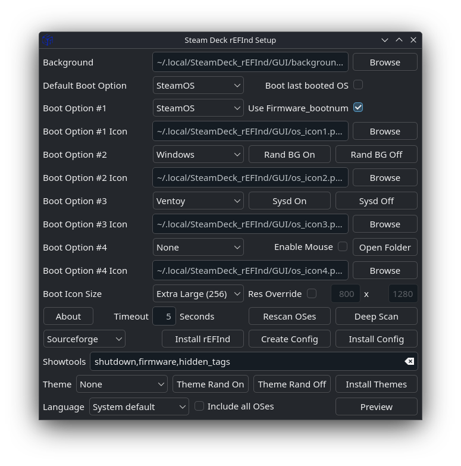

# SteamDeck_rEFInd

An easy [rEFInd](https://www.rodsbooks.com/refind/) boot manager setup for the Steam Deck, for dual booting SteamOS alongside Windows (internal NVMe or micro SD card), other Linux distros, Batocera, and Ventoy.



Please feel free to donate and support me at the following link. Donations are not required, nor are they expected. I will continue to work on this repository and potential future variations, with or without donations.
<a href="https://www.paypal.com/cgi-bin/webscr?cmd=_s-xclick&hosted_button_id=2PSSUQVX33L6N">
  
</a>

## Installation (GUI — recommended)

Make sure your `sudo` password is set and you are connected to the internet, then run this from a terminal in desktop mode:

```
curl -L https://github.com/jlobue10/SteamDeck_rEFInd/raw/main/install-GUI.sh | sh
```

The installer stages everything into `~/.local/SteamDeck_rEFInd/`, installs the latest GUI release package, and creates a desktop shortcut.

### Using the GUI

1. **Install rEFInd** — needed the first time only. Leave Sourceforge selected in the dropdown (the preferred source); `pacman` is available as a fallback if the Sourceforge download has issues. If you already have a working rEFInd install, you can skip this step.
2. **Pick your boot options.** The GUI scans the EFI System Partition at startup (and via the **Rescan OSes** button) and auto-populates the boot options with what's actually installed — SteamOS, Windows, and any Linux distro. The four boot options are the icon order on the boot screen, left to right.
3. **Create Config** — generates `~/.local/SteamDeck_rEFInd/GUI/refind.conf`, which you can inspect or hand-edit. If you change the background or icon images, click **Create Config** again so the new files get staged.
4. **Install Config** — copies the config, background, and icons to the ESP that actually boots rEFInd. No password prompt: the installer sets up a root-owned helper script plus a sudoers rule restricted to exactly that script (it falls back to asking for your `sudo` password if the rule is missing).

Additional buttons and options:

- **Sysd On / Sysd Off** — enable or disable the `bootnext-refind` systemd service, which keeps rEFInd at the front of the EFI boot order on every boot (SteamOS updates can otherwise reorder or drop it). These pop up an xterm that asks for the `sudo` password and shows the service status when done.
- **Rand BG On / Rand BG Off** — background randomizer: on each SteamOS boot, picks a random PNG from `~/.local/SteamDeck_rEFInd/backgrounds/` and installs it as the rEFInd background. Add or remove PNGs in that folder as you like. If you turn it off and want a fixed background again, redo Create Config + Install Config.
- **Use Firmware_bootnum** — SteamOS-only option that keeps the SteamOS icon visible during the rEFInd → SteamOS handoff (otherwise the screen is blank for a moment). It requires the SteamOS EFI entry to exist when the config is created.
- **Ventoy** boot option — boots whichever micro SD card or USB drive it finds first with the `VTOYEFI` partition label (not both concurrently).

Custom images: backgrounds should be 1,280x800 PNG files and icons square PNGs — ideally matching the **Boot Icon Size** you pick in the GUI (128x128 for the default; 256 and 512 versions of the Steam and Windows icons are included for the larger sizes). Other sizes still work, just scaled. PNG is required because other formats are hit and miss with rEFInd.

### Hand-editing the staged files

Everything the GUI installs to the ESP is first staged as plain files under `~/.local/SteamDeck_rEFInd/` (`%LOCALAPPDATA%\SteamDeck_rEFInd` for the Windows app). Editing those files by hand is supported — the install buttons copy whatever is there:

- `GUI/refind.conf` — generated by **Create Config**. You can tweak or extend it (extra stanzas, rEFInd options the GUI doesn't expose) before pressing **Install Config**, which installs it exactly as edited — along with `GUI/active_theme.conf` when a theme is selected. Pressing **Create Config** again regenerates the file, so keep a copy of manual edits you want to re-apply.
- `GUI/background.png` and `GUI/os_icon1.png` … `os_icon4.png` — the staged copies of the selected background and icons. Replacing these files directly (PNG only) works just as well as picking them in the GUI; **Install Config** installs whatever is staged.
- `backgrounds/` — the pool the background randomizer draws from on each boot; add or remove PNGs as you like.
- `themes/<name>/` — the tree **Install Themes** copies to the ESP (every folder containing a `theme.conf` counts). You can edit a bundled theme — swap its icons, tweak its `theme.conf` — or drop in a new one, then press **Install Themes** again to install it as-is.

### Windows from micro SD card

Automated since 2.0.0 — just make sure the SD card is inserted when you click **Create Config**; the Windows-on-SD entry and its partition GUID are detected and resolved automatically.

If you ever need to do it manually, edit `/esp/efi/refind/refind.conf` with `sudo`, and in the "Windows SD card" stanza set `volume` to the SD card ESP's partition UUID (find it with `lsblk -o NAME,PARTUUID` or KDE Partition Manager) and remove the `disabled` line. Add `disabled` to the internal "Windows" stanza if you don't want both shown.

### Game Mode tip

For quick config changes from Game Mode, set up the [Plasma Nested Session](https://gist.github.com/davidedmundson/8e1732b2c8b539fd3e6ab41a65bcab74) and add its shortcut to Steam. Launch the nested session, run the GUI, install your changes, then use the 'Return to Gaming Mode' desktop shortcut to exit.

## Themes

The repo ships a set of community rEFInd themes under `themes/`. A theme restyles the whole boot menu at once — background, OS/tool icons, selection highlights, and (for some themes) fonts — by way of the theme's own `theme.conf`, which supersedes the matching settings in the generated `refind.conf`.

How it works: when a theme is selected, **Create Config** appends a single stable line to the end of the generated config — `include themes/active_theme.conf` — and stages `active_theme.conf` (a copy of the chosen theme's `theme.conf`) next to it. Switching themes just replaces that one file; `refind.conf` itself never changes per theme.

Using themes from the GUI:

1. **Theme** dropdown — pick a theme (or `Random` to have one picked for you at Create Config time; `None` keeps the classic look). Then **Create Config** and **Install Config** as usual.
2. **Install Themes** — copies the whole `themes/` tree to the ESP (`EFI/refind/themes/`, about 12 MB). Needed once before an installed config's theme can render, and again only if the shipped themes change.
3. **Theme Rand On / Theme Rand Off** (SteamOS/Linux only) — enable or disable the per-boot theme randomizer service (`rEFInd_theme_randomizer`): on each SteamOS boot it copies a random theme's `theme.conf` over `themes/active_theme.conf` on the ESP. It only acts when the live `refind.conf` contains the theme include line, so it is inert while the Theme dropdown is `None`.

Note: if both the background randomizer and the theme randomizer are enabled, the theme's banner wins — a theme's `theme.conf` sets its own `banner`, which supersedes the randomized `background.png`.

### Theme credits

**All theming credit goes to the original theme authors.** These themes are redistributed here (unmodified apart from folder-name normalization) purely for install convenience; please star/support the upstream repos.

| Theme | Author | Upstream | License |
|---|---|---|---|
| BlackCatMuzzle | Scorpi-ON (XIIIMICT) | https://github.com/XIIIMICT/BlackCatMuzzle-rEFInd | MIT |
| Matrix-rEFInd | Yannis Vierkötter (Yannis4444) | https://github.com/Yannis4444/Matrix-rEFInd | MIT |
| rEFInd-fallout | awanwar | https://github.com/awanwar/rEFInd-fallout | MIT |
| rEFInd-glassy | Pr0cella | https://github.com/Pr0cella/rEFInd-glassy | No stated theme license (its LICENSE file covers only the bundled Nimbus font, AGPL-3.0) — redistributed with attribution* |
| rEFInd-mountain | Chris Alves (Chrisae9) | https://github.com/Chrisae9/rEFInd-mountain | MIT |
| Starwars-rEFInd | thilakshan2003 | https://github.com/thilakshan2003/Starwars-rEFInd | No license file — redistributed with attribution* |
| wave | zeeshan933 | https://github.com/zeeshan933/Refind-Themes | No license file — redistributed with attribution* |

\* These themes carry no explicit redistribution license; they are included with full attribution and links to the originals, and will be removed immediately at the original author's request.

More themes to explore (installable manually the same way — drop a folder under `themes/` whose `theme.conf` uses `themes/<folder>/...` paths):

- [rEFInd Themes Collection](https://refind-themes-collection.netlify.app/) — gallery site; its source and theme list live on GitHub at [martinmilani/rEFInd-theme-collection](https://github.com/martinmilani/rEFInd-theme-collection)
- [rodsbooks.com — Using rEFInd Themes](https://www.rodsbooks.com/refind/themes.html)

## Windows app (new in 2.0.0)

The GUI also builds and runs on Windows (Qt6), so you can configure and install rEFInd from the Windows side of a dual-boot Deck. Download `SteamDeck_rEFInd-<version>-setup.exe` from the [Releases](https://github.com/jlobue10/SteamDeck_rEFInd/releases) page. The installer requests Administrator access so executable code and privileged helpers can be protected under Program Files; mutable configuration stays in `%LOCALAPPDATA%\SteamDeck_rEFInd`. Release builds are code-signed via SignPath Foundation — see `Windows/GUI/SIGNING.md`.

## Script-only installation (deprecated... no GUI)

The script method assumes valid EFI boot files exist at `/esp/efi/steamos/steamcl.efi` (SteamOS) and `/esp/efi/Microsoft/Boot/bootmgfw.efi` (Windows) — which is the case after a typical dual boot setup. You can verify by holding Volume Up + Power, choosing "Boot from file", and selecting each manually; if either doesn't boot correctly, don't proceed unless you know how to point the `refind.conf` boot stanzas at your correct EFI files.

If you want custom icons (square PNGs, 128x128 at the default icon size) or a custom background (1,280x800 PNG), swap the files and update `refind.conf` to match **before running the installation script**.

From a SteamOS command line in desktop mode:

```
git clone https://github.com/jlobue10/SteamDeck_rEFInd/
cd SteamDeck_rEFInd
chmod +x SteamDeck_rEFInd_install.sh
./SteamDeck_rEFInd_install.sh
```

If the `pacman` repositories are having issues, run this instead for a `pacman`-free installation (rEFInd downloaded from Sourceforge):

```
chmod +x refind_install_no_pacman.sh
./refind_install_no_pacman.sh
```

Afterwards rEFInd is set up with SteamOS as the default OS. The `timeout` in `refind.conf` (default 5 seconds) is how long the menu waits before booting the default; `-1` boots the default immediately unless a button or trackpad is touched during power-on. Select an OS with the right trackpad + R2, or the D-Pad + A button.

The supplied config uses manual boot stanzas on purpose, to control the icon order left to right. For everything else the config supports, see the [rEFInd documentation](https://www.rodsbooks.com/refind/).

## :heavy_exclamation_mark: Dual boot fix (Windows boots straight past rEFInd)

***This is one of the most commonly missed steps.*** Without it, Windows re-inserts itself at the top of the boot order and you never see the rEFInd menu. Two ways to fix it:

**Option 1 — disable the Windows EFI entry** (requires booting the SteamOS recovery USB or another live Linux):

```
1. Open "Konsole"
2. type: efibootmgr
## Take note of the Windows EFI four digit number and replace the XXXX in the following command with that number.
3. type: sudo efibootmgr -b XXXX -A
```

**Option 2 — run the Windows-side "Dual Boot Fix"** (use this especially if option 1 gives a `Boot entry not found` error). While booted into Windows, download and unzip [Dual Boot Fix](https://www.mediafire.com/file/w7jswsuctvnnd7k/Dual+Boot+Fix.zip/file), then run `Setup_rEFInd_Windows_RunAsAdmin` as administrator. Instead of disabling the Windows entry, it creates a scheduled task that moves rEFInd back to the top of the boot list whenever Windows runs. There's a [video from Deck Wizard](https://youtu.be/ubWPIf2DbvE?si=22PPs0SAVu1cvmOL&t=1077) showing this step (time code 17:57).

## Notes

- **Missing EFI entries after a BIOS update** — restoring them is automated by the systemd service. If the SteamOS and rEFInd entries were deleted, manually boot into SteamOS once via 'Boot from file' in BIOS and they'll be recreated.
- **systemd service health** — SteamOS's redundant A/B root partitions can occasionally leave the service missing after a branch change or update. Check with `sudo systemctl status bootnext-refind.service`; if it isn't active/enabled, recopy `systemd/bootnext-refind.service` to `/etc/systemd/system/` and run `sudo systemctl enable --now bootnext-refind.service`. (The GUI's Sysd On/Off buttons also handle this.)
- **Reinstalling Windows** — re-enable the Windows EFI boot entry first so the installation can complete: `sudo efibootmgr -b YYYY -a` (YYYY = the Windows entry number). Disable it again afterwards (see the dual boot fix above).
- **Corrupted display when booting into Windows** — run this once from an admin command prompt on a new Windows install: `bcdedit.exe -set {globalsettings} highestmode on` (PowerShell: `bcdedit /set "{globalsettings}" highestmode on`). It prevents the issue entirely.
- **Browse dialog shows no PNG previews / "view as icons" option (KDE)** — the picker requests the desktop's native file dialog, which only appears (with thumbnails and view options) when the Qt platform-integration plugin matching the GUI's Qt version is installed; otherwise Qt falls back to a bare dialog with neither. Since v2.3.4 the package builds against **Qt6**, whose KDE integration ships with Plasma 6 desktops (SteamOS 3.7+ included), so this works out of the box — if you still see the bare dialog, update to v2.3.4 or newer. On an older Qt5 build (`ldd $(command -v SteamDeck_rEFInd)` shows `libQt5Widgets`), install the Qt5 integration (`plasma5-integration`, where the distro still ships it) — or just update.

## Uninstalling

Run the uninstall script (staged by the GUI install; also available in this repo under `scripts/`):

```
~/.local/SteamDeck_rEFInd/scripts/uninstall_rEFInd.sh
```

It disables the `bootnext-refind` and background-randomizer services first (otherwise the boot entry would be recreated on the next boot), deletes the rEFInd boot entries that target the Deck's ESP (a rEFInd installed from the Windows side, e.g. on an SD card, is detected and left alone), re-activates the Windows boot entry, removes `EFI/refind` and `EFI/Xbox360` from `/esp` plus `/boot/refind_linux.conf`, and removes the pacman `refind` package. Flags:

- `--keep-esp-files` — undo only the services and boot entries; keep rEFInd's files on `/esp`
- `--remove-app` — also remove the SteamDeck_rEFInd GUI package, `~/.local/SteamDeck_rEFInd`, and the desktop shortcuts

On the Windows side, uninstalling "SteamDeck rEFInd GUI" from Settings > Apps asks whether to also remove rEFInd itself and then performs the equivalent cleanup automatically.

## [SteamOS reinstallation considerations](https://github.com/jlobue10/SteamDeck_rEFInd/issues/49)

## Related project

[rEFInd_GUI](https://github.com/jlobue10/rEFInd_GUI) is this project's sibling for laptops, desktops, and other handhelds (ASUS ROG Ally/Ally X, Legion Go, and more), with generic Linux + Windows dual boot support and secure boot guidance.

## References

[rEFInd Boot Manager reference](https://www.rodsbooks.com/refind/ "rEFInd Boot Manager")

[efibootmgr reference](https://linux.die.net/man/8/efibootmgr "efibootmgr")

[Video tutorial by Deck Wizard](https://www.youtube.com/watch?v=ubWPIf2DbvE) — worth a watch before posting an issue.

## Translations

The GUI follows the system language and currently ships translations for 20 languages alongside English —
German, Dutch, Spanish, French, Italian, Portuguese, Russian, Ukrainian, Turkish,
Japanese, Korean, Simplified Chinese, Vietnamese, Indonesian, Hindi,
Bengali, Sicilian, Arabic, Persian (Farsi), and Urdu (right-to-left layout included
for Arabic, Persian, and Urdu) (untranslated strings fall back to
English). Translation contributions are welcome — see the contributor guide in
[I18N_AUDIT.md](I18N_AUDIT.md): add a `SteamDeck_rEFInd_<lang>.ts` file under
`GUI/src/`, list it in `CMakeLists.txt`, and translate it with Qt Linguist.

## Acknowledgements

Special thanks to **[DeckWizard](https://www.youtube.com/c/DeckWizard)** for extensive testing and feedback.

Special thanks to Reddit user **ChewyYui** for solving the annoying Windows graphical glitch and helping to figure out the SteamOS splash screen setting from the SteamOS manual boot stanza.

Credit to GitHub user **CryoByte33** (maker of [steam-deck-utilities](https://github.com/CryoByte33/steam-deck-utilities)) for zenity additions to my own code.

Also thank you to GitHub user **YoshiAye** for the updated background that I made default for the GUI installation.

This project (and its sibling [rEFInd_GUI](https://github.com/jlobue10/rEFInd_GUI)) is only intended to simplify the installation and configuration of the rEFInd boot manager. All credit for the rEFInd boot manager itself goes to **Roderick W. Smith** ([rodsbooks.com/refind](https://www.rodsbooks.com/refind/)); rEFInd performs all of the complicated bootloader tasks.

## Additional comments

If you have an idea for code, script, or GUI improvement, please reach out to me. I am all for making this repository as good as possible. If you are going to use some aspect of my code for your own design, please give some credit or acknowledgment for the original code.
